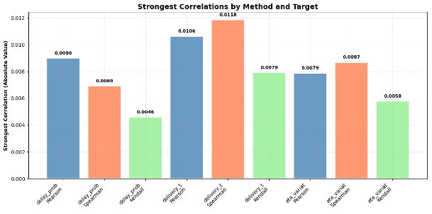
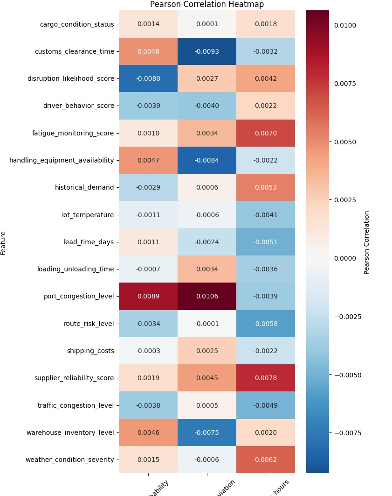

# 👋 Welcome to *The Express*

## 📦 Understanding Retail Supply Chain Delays: Collaborative Data Science Project!


Welcome to **The Express**, a collaborative data science initiative developed to 
investigate the persistent issue of delivery delays in the U.S. retail supply 
chain. Combining real-world logistics data from Southern California and a 
systems thinking approach, this project aims to uncover the complex 
interdependencies among operational, environmental, and behavioral factors that 
contribute to delivery disruptions. Our analysis informs strategies to mitigate 
such delays and improve retail supply chain performance.

---

## Table of Contents

- [Project Overview](#project-overview)  
- [Project Milestones](#project-milestones)  
- [Problem Statement](#problem-statement)  
- [Research Questions](#research-questions)  
- [Data Modelling and Preparation](#data-modelling-and-preparation)  
- [Data Analysis and Methodology](#data-analysis-and-methodology)  
- [Findings](#findings)  
- [Limitations and Future Work](#limitations-and-future-work)  
- [Tech Stack](#tech-stack)  
- [Repository Structure](#repository-structure)  
- [Setup and Usage](#setup-and-usage)  
- [Project Team Members](#project-team-members)  
- [License](#license)  
- [Acknowledgments](#acknowledgments)

---

## Project Overview

Supply chain reliability has become critical for competitive success in retail, 
with rising consumer expectations for fast and reliable delivery. However, U.S. 
Retailers continue to face delivery delays, especially during peak seasons or 
in metropolitan areas. Despite technological advancements such as real-time 
tracking and predictive routing, these delays persist. The Express investigates 
these inefficiencies through statistical and systems-based analysis to identify 
root causes and develop actionable insights.

---

## Project Milestones

| Milestone | Description |
|----------|-------------|
| **0 - Cross-Cultural Collaboration** | Formed a team and established shared norms, values, and tools using GitHub and structured documentation. |
| **1 - Problem Identification** | Scoped our research domain through literature review, data discovery, and systems thinking. |
| **2 - Data Collection** | Selected, cleaned, and documented a comprehensive dataset on Southern California logistics operations. |
| **3 - Data Analysis** | Conducted EDA, correlation analysis, and interaction modeling. |
| **4 - Communicating Results** | Designed visuals and messaging tailored to supply chain stakeholders. |
| **5 - Final Presentation** | Shared findings with MIT Emerging Talent faculty, peers, and partners. |

---

## Problem Statement

The retail supply chain in the United States is experiencing increasingly 
complex and systemic delays, causing ripple effects across customer 
satisfaction, business revenue, and national logistics capacity. Our project 
centers on the Southern California region—a logistics hub with high volumes of 
freight movement via truck, rail, and sea. Through a data-driven approach, we 
aim to answer why delivery delays continue despite modernization and how data 
science can guide interventions.

---

## Research Questions

**Primary Research Question**  
What are the key operational, environmental, and behavioral factors that 
contribute to delivery delays in the U.S. retail supply chain, and how can they 
be mitigated using data science?

**Supporting Questions**  
- What impact do traffic congestion, port conditions, warehouse performance, 
  and environmental factors have on delivery timing?  
- Can we predict delivery delays based on real-time logistics and sensor data?  
- How do seasonal surges and disruptive events affect last-mile delivery?  
- Which features have the most significant influence when considered together?

---

## Data Modelling and Preparation

We used a dataset titled *Southern California Supply Chain Logistics Data* from 
Kaggle. It includes 32,066 records and 26 variables collected hourly between 
2021 and 2024. The dataset represents operational data across multiple modes of 
transport (trucks, rail, drones), enriched with GPS, sensor, and warehouse data.

### Key Preparation Steps

- Loaded and explored using pandas and Jupyter Notebooks  
- Removed duplicate and irrelevant columns  
- Validated column types, formats, and ranges  
- Identified inconsistencies between the documented schema and actual values  

### Key Feature Categories

- **Logistics**: Fuel usage, equipment availability, loading time  
- **Environmental**: Weather severity, port congestion, traffic conditions  
- **Operational**: Order fulfillment rate, lead time, supplier reliability  

### Target Variables

- `delivery_time_deviation` (hours): Actual vs. estimated delivery time  
- `delay_probability` (float): Predicted likelihood of delay  
- `delay_risk_class` (categorical): Low, Moderate, High risk levels  

---

## Data Analysis and Methodology

### Phase I: Raw Dataset

We used Pearson, Spearman, and Kendall Tau correlation metrics to analyze 
relationships between 16 features and 3 delay indicators. All individual 
correlations were weak.

### Phase II: Corrected Dataset

After re-aligning variable definitions with documented expectations, we re-ran 
the analysis. This similarly revealed weaker patterns through manual interaction 
analysis.

### Summary

- Correlation matrices were mostly inconclusive  
- Multivariate analysis did not show higher predictive power  
- We prioritized interpretability and did not use machine learning in this 
  phase, but recommend ensemble models for future work  

---

## Findings

- No single variable strongly correlates with delivery delay  
- Port congestion was the most consistently relevant variable  
- Compound risk factors were also less impactful  
- Visualizations offered clearer insights than raw correlation values  
- Findings support ripple effect theories from supply chain literature  

> The strongest relationship we found was only 0.0118 between port congestion 
> and delivery time deviation—extremely close to zero.



*Figure I: A heatmap showing the correlation between key features and delivery time.*



---

## Limitations and Future Work

### Known Limitations

- No temporal modeling—data is cross-sectional  
- Sensor data has inconsistencies (e.g., negative temps in SoCal)  
- Product types (perishables vs. durables) not distinguished  
- Rare disruptions (e.g., strikes, earthquakes) not captured  

### Future Work

- Apply machine learning models (e.g., XGBoost, SHAP)  
- Use time-series and regional identifiers  
- Add external data on labor, weather, and policy events  
- Develop a real-time dashboard for managers  

---

## Tech Stack

- **Python**: pandas, numpy, seaborn, matplotlib  
- **Jupyter Notebooks**: data cleaning, EDA, modeling  
- **Tableau**: for visualization and dashboards  
- **Git + GitHub**: for team collaboration and version control  

---

## Repository Structure

```plaintext
The-Express/
├── 0_domain_study/
├── 1_datasets/
├── 2_data_preparation/
├── 3_data_exploration/
├── 4_data_analysis/
├── 5_communication_strategy/
├── 6_final_presentation/
├── collaboration/
├── notes/
├── requirements.txt
└── README.md

```

## ⚙️ Setup and Usage

To run this project locally:

```bash
# Clone the repository
git clone https://github.com/MIT-Emerging-Talent/ET6-CDSP-group-22-repo.git
cd ET6-CDSP-group-22-repo

# Create and activate a virtual environment
python -m venv venv
source venv/bin/activate       # On macOS/Linux
# OR
venv\Scripts\activate          # On Windows

# Install dependencies
pip install -r requirements.txt

# Launch Jupyter Notebook
jupyter notebook
```

## 👥 Project Team Members

This project was built by a global team of passionate learners as part of the
MIT Emerging Talent Program.

- [Jawid Mohseni](https://github.com/JawidMohseni)  
- [Razan Ibrahim](https://github.com/Razan-O-Elobeid)  
- [Ismatova Rumiya](https://github.com/Ismatova-Rumiya)  
- [Alemayehu Desta](https://github.com/Alemayehu-Desta)  
- [Omnia Shawir](https://github.com/omniaNS)

---

## 📜 License

This project is licensed under the MIT License.
See the LICENSE file for full details.

---

## 🙏 Acknowledgments

We extend our sincere gratitude to the **MIT Emerging Talent Team** for  
providing the structure, mentorship, and global platform that made this  
collaboration possible.

**Special thanks to:**

- The instructors and mentors who guided us  
- The open-source data community for accessible datasets  

This project reflects the power of cross-cultural teamwork and data-driven thinking.


