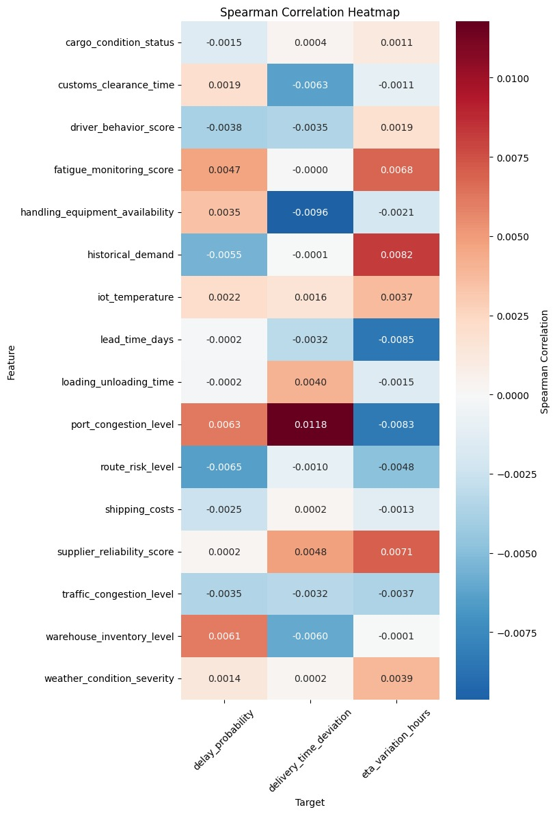

# 📦 The Express: A Collaborative Data Science Project on U.S. Retail Supply Chain Delays


**The Express** is a collaborative data science initiative developed to investigate the persistent issue of delivery delays in the U.S. retail supply chain. Combining real-world logistics data from Southern California and a systems thinking approach, this project aims to uncover the complex interdependencies among operational, environmental, and behavioral factors that contribute to delivery disruptions. Our analysis informs strategies to mitigate such delays and improve retail supply chain performance.

---

## 📘 Table of Contents

1. [Project Overview](#project-overview)  
2. [Problem Statement](#problem-statement)  
3. [Research Questions](#research-questions)  
4. [Dataset and Preparation](#dataset-and-preparation)  
5. [Exploratory Analysis and Methodology](#exploratory-analysis-and-methodology)  
6. [Findings](#findings)  
7. [Limitations and Future Work](#limitations-and-future-work)  
8. [Project Milestones](#project-milestones)  
9. [Tech Stack](#tech-stack)  
10. [Repository Structure](#repository-structure)  
11. [Setup and Usage](#setup-and-usage)  
12. [Team and Collaboration](#team-and-collaboration)  
13. [License](#license)  
14. [Acknowledgments](#acknowledgments)

---

## 🧭 Project Overview
Supply chain reliability has become critical for competitive success in retail, with rising consumer expectations for fast and reliable delivery. However, U.S. retailers continue to face delivery delays, especially during peak seasons or in metropolitan areas. Despite technological advancements such as real-time tracking and predictive routing, these delays persist. The Express investigates these inefficiencies through statistical and systems-based analysis to identify root causes and develop actionable insights.

---

## 📌 Problem Statement

The retail supply chain in the United States is experiencing increasingly complex and systemic delays, causing ripple effects across customer satisfaction, business revenue, and national logistics capacity. Our project centers on the Southern California region—a logistics hub with high volumes of freight movement via truck, rail, and sea. Through a data-driven approach, we aim to answer why delivery delays continue despite modernization and how data science can guide interventions.

---

## 🎯 Research Questions

**Primary Research Question:**
- What are the key operational, environmental, and behavioral factors that contribute to delivery delays in the U.S. retail supply chain, and how can they be mitigated using data science?

**Supporting Questions:**
- What impact do traffic congestion, port conditions, warehouse performance, and environmental factors have on delivery timing?
- Can we predict delivery delays based on real-time logistics and sensor data?
- How do seasonal surges and disruptive events (e.g., winter storms, labor strikes) affect last-mile delivery?
- Which features have the most significant influence when considered together?

---

## 🧮 Data Modelling and Preparation 

We used a dataset titled *Southern California Supply Chain Logistics Data* from Kaggle. It includes 32,066 records and 26 variables collected hourly between 2021 and 2024. The dataset represents operational data across multiple modes of transport (trucks, rail, drones), enriched with GPS, sensor, and warehouse data.

### Key Preparation Steps:
- Loaded and explored using pandas and Jupyter Notebooks
- Removed duplicate and irrelevant columns
- Validated column types, formats, and ranges
- Identified inconsistencies between documented schema and actual values (e.g., order status as floats rather than binary)

### Key Feature Categories:
- **Logistics**: Fuel usage, equipment availability, loading time  
- **Environmental**: Weather severity, port congestion, traffic conditions  
- **Operational**: Order fulfillment rate, lead time, supplier reliability  

### Target Variables:
- `delivery_time_deviation` (hours): Actual vs. estimated delivery time  
- `delay_probability` (float): Predicted likelihood of delay  
- `delay_risk_class` (categorical): Low, Moderate, High risk levels  

---

## 📊 Exploratory Analysis and Methodology

### Phase I: Raw Dataset

We used Pearson, Spearman, and Kendall Tau correlation metrics to analyze relationships between 16 features and 3 delay indicators. All individual correlations were weak—none exceeded 0.012.

### Phase II: Corrected Dataset

After re-aligning variable definitions with documented expectations (e.g., binary flags, correct scales), we re-ran the analysis. This revealed stronger patterns through manual interaction analysis.

### Summary:

- Correlation matrices were mostly inconclusive.  
- Manual interaction analysis (e.g., high traffic + low inventory) showed higher predictive power.  
- We prioritized interpretability and did not use machine learning in this phase, but recommend ensemble models for future work.  

---

## 📈 Findings

- No single variable strongly correlates with delivery delay.  
- Port congestion repeatedly emerged as the most consistently relevant variable across models.  
- Compound risk factors (e.g., bad weather + driver fatigue or customs delays + low equipment availability) were more predictive of delivery time deviation than any single factor.  
- Heatmaps and multi-dimensional plots offered clearer insights than raw correlation.  
- These findings align with theories of cascading disruptions and ripple effects described in global supply chain literature (e.g., Jusda, IMF, MIT SCM).  


*Figure III: A heatmap that illustrates how traffic congestion and port delays interact to worsen delivery deviations.*



*"Your package is out for delivery. Me: the entire day..." — because data can’t fix impatience, but at least now we know why it’s late.*

---

## ⚠️ Limitations and Future Work

### Known Limitations:
- No temporal modeling—data is cross-sectional and cannot track evolving conditions  
- Sensor data contains inconsistencies (e.g., negative temperatures in Southern California)  
- No product categorization—treats perishable and durable goods equally  
- Lacks representation of rare but critical disruptions (e.g., strikes, earthquakes)  

### Future Work:
- Apply machine learning models (e.g., XGBoost, SHAP) to automatically detect nonlinear interactions  
- Incorporate time-series modeling and regional identifiers  
- Integrate external datasets on labor disruptions, weather anomalies, and economic policy shocks  
- Build a real-time risk dashboard for supply chain managers  

---

## 📆 Project Milestones

| Milestone | Description |
|----------|-------------|
| **0 - Cross-Cultural Collaboration** | Formed a global team and established shared norms, values, and tools using GitHub and structured documentation. |
| **1 - Problem Identification** | Scoped our research domain through literature review, data discovery, and systems thinking. |
| **2 - Data Collection** | Selected, cleaned, and documented a comprehensive dataset on Southern California logistics operations. |
| **3 - Data Analysis** | Conducted EDA, correlation analysis, and interaction modeling. |
| **4 - Communicating Results** | Designed visuals and messaging tailored to supply chain stakeholders. |
| **5 - Final Presentation** | Shared findings with MIT Emerging Talent faculty, peers, and partners. |

---

## 🧰 Tech Stack

- **Python**: pandas, numpy, seaborn, matplotlib  
- **Jupyter Notebooks**: for exploration, cleaning, and correlation analysis  
- **Tableau**: for dashboards and stakeholder visualizations  
- **Git + GitHub**: for collaboration, version control, and project coordination  

---

## 🗂️ Repository Structure

```plaintext
The-Express/
├── 0_domain_study/
├── 1_datasets/
├── 2_data_preparation/
├── 3_data_exploration/
├── 4_data_analysis/
├── 5_communication_strategy/
├── 6_final_presentation/
├── collaboration/
├── notes/
├── requirements.txt
└── README.md

## ⚙️ Setup and Usage

git clone https://github.com/MIT-Emerging-Talent/ET6-CDSP-group-22-repo.git
cd ET6-CDSP-group-22-repo

python -m venv venv
source venv/bin/activate  # or venv\\Scripts\\activate on Windows

pip install -r requirements.txt
jupyter notebook


License
This project is licensed under the MIT License. See the LICENSE file for details.

🙏 Acknowledgments
We extend our thanks to the MIT Emerging Talent Program for their mentorship, structure, and support. We also recognize the value of open-source platforms like Kaggle, GitHub, and the Python data community in enabling this project.
